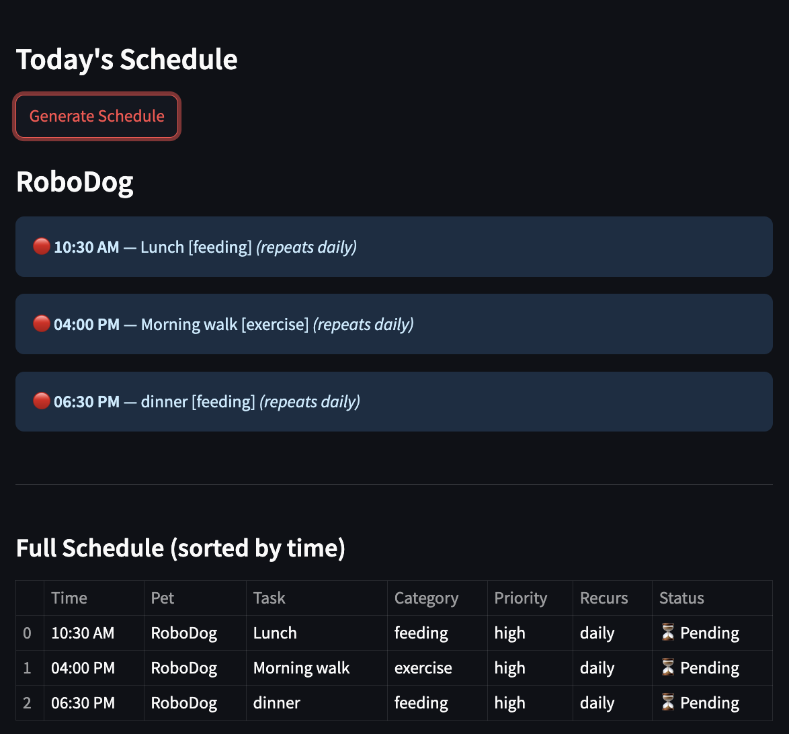

# PawPal+ (Module 2 Project)

You are building **PawPal+**, a Streamlit app that helps a pet owner plan care tasks for their pet.

## Scenario

A busy pet owner needs help staying consistent with pet care. They want an assistant that can:

- Track pet care tasks (walks, feeding, meds, enrichment, grooming, etc.)
- Consider constraints (time available, priority, owner preferences)
- Produce a daily plan and explain why it chose that plan

Your job is to design the system first (UML), then implement the logic in Python, then connect it to the Streamlit UI.


## Getting started

### Setup

```bash
python -m venv .venv
source .venv/bin/activate  # Windows: .venv\Scripts\activate
pip install -r requirements.txt
```


## Features

- **Multi-pet support** — an owner can manage any number of pets, each with their own independent schedule
- **Task scheduling** — tasks have a title, category, priority, due date, and optional notes; each task is assigned a unique ID automatically
- **Sorting by time** — schedules can be displayed in chronological or reverse-chronological order without modifying the underlying task list
- **Daily recurrence** — tasks marked `"daily"` automatically generate the next occurrence when completed, shifted forward by one day
- **Weekly recurrence** — tasks marked `"weekly"` auto-schedule the next occurrence one week ahead on completion
- **Conflict warnings** — adding a task that overlaps in time with an existing task immediately triggers a warning; a full conflict scan is also available
- **Cross-pet conflict detection** — the owner-level scanner catches cases where two different pets have tasks at the exact same time
- **Overdue detection** — incomplete tasks past their due date can be retrieved for any pet's schedule
- **Upcoming task filtering** — tasks due within the next N days can be queried across a pet's schedule
- **Filter by completion status** — a schedule can be filtered to show only pending or only completed tasks
- **Filter by pet name** — tasks can be filtered by the name of the assigned pet, useful for shared schedule views
- **Task history** — completed tasks are retained and queryable separately from active tasks
- **Medication tracking** — each pet maintains a list of medications that can be added or removed
- **Streamlit UI** — a web interface lets the owner add pets, schedule tasks with recurrence and due times, and view today's schedule with conflict alerts

## Smarter Scheduling

The scheduling system was extended beyond basic task tracking with three algorithmic features:

### Recurring Tasks
Tasks can be marked as `"daily"` or `"weekly"` via the `recurrence` field on `CareTask`. When `complete_task()` is called on a recurring task, the system automatically creates the next occurrence with the due date shifted forward by one day or one week respectively. This means a recurring feeding or medication task never needs to be manually re-added.

### Conflict Detection
When a task is added to a `Schedule`, `_check_conflict()` checks whether any existing incomplete task shares the same `due_date`. If a conflict is found, a warning is printed immediately. `get_conflicts()` performs a full scan of a single pet's schedule and returns all conflicts at once. At the owner level, `get_all_conflicts()` goes further — it detects both same-pet conflicts and cross-pet conflicts, catching cases where two different pets have tasks scheduled at the exact same time.

### Sorting and Filtering
`sort_by_time()` returns tasks ordered by `due_date`, with an optional `reverse` flag for latest-first ordering. `filter_by_status()` returns tasks matching a given completion state (pending or done). `filter_by_pet_name()` returns tasks assigned to a specific pet by name (case-insensitive), useful when viewing a shared schedule across multiple pets.

## Testing PawPal+

### Running the tests

```bash
# Activate your virtual environment first
source .venv/bin/activate  # Windows: .venv\Scripts\activate

python -m pytest test_pawpal.py -v
```

### What the tests cover

The test suite (`test_pawpal.py`) contains **15 tests** across four areas:

| Area | Tests | What is verified |
|---|---|---|
| **Core behavior** | 5 | Task completion, adding tasks, overdue detection, owner pet management |
| **Sorting** | 4 | Chronological order, reverse order, non-mutation of original list, empty schedule |
| **Recurrence** | 3 | Daily task auto-creates next occurrence, new task inherits all fields with a fresh ID, non-recurring tasks don't spawn duplicates |
| **Conflict detection** | 3 | Same-time tasks on the same pet trigger a conflict, different-time tasks do not, empty schedule returns no conflicts |

### Confidence Level

**★★★★☆ (3 / 5)**

The core scheduling behaviors — task completion, recurrence, sorting, and same-pet conflict detection — are well covered and all 15 tests pass. The remaining gap is cross-pet conflict detection and owner-level edge cases (e.g., owner with no pets, invalid pet IDs), which are not yet tested. 

## 📸 Demo

<a href="uml_final.png" target="_blank">
  
</a>
